# SaludRed — Coordinación de camas hospitalarias en red EPS/IPS

Sistema de gestión y asignación de camas para una EPS que coordina múltiples IPS,
con base de datos relacional PostgreSQL, API REST, interfaz web por rol,
analítica de la red y exposición de la información clínica como recursos
HL7 FHIR R4.

## El problema

La información sobre ocupación, altas, limpieza, bloqueos y disponibilidad de
camas está fragmentada y se actualiza tarde. La consecuencia no es
necesariamente falta de camas: puede existir capacidad física suficiente, pero
si el estado de una cama no se conoce a tiempo, esa cama no se puede usar.

Eso produce esperas para pacientes que requieren hospitalización, llamadas y
verificaciones repetidas entre áreas, información duplicada y ausencia de
trazabilidad sobre quién cambió un dato y cuándo.

El sistema ataca cuatro puntos concretos:

| Principio | Qué significa en el sistema |
|---|---|
| Visibilidad | todos los actores autorizados consultan el mismo estado |
| Oportunidad | el cambio se registra cuando ocurre, no cuando alguien pregunta |
| Coordinación | solicitudes, asignaciones y estados se comparten entre IPS |
| Trazabilidad | cada cambio deja registro de qué cambió, cuándo y quién lo hizo |

## Alcance

Una EPS coordina una red de IPS. Cada IPS opera sedes, servicios, habitaciones y
camas. El modelo es jerárquico y autorreferenciado: incorporar una IPS nueva o
una cama nueva es una inserción, nunca una migración de esquema.

```
EPS
 ├── IPS Norte ── sede ── servicio ── habitación ── cama
 ├── IPS Sur   ── sede ── servicio ── habitación ── cama
 └── IPS Centro ─ sede ── servicio ── habitación ── cama
```

## Arquitectura

```
   Navegador ── nginx (web)     ← interfaz + proxy inverso, un solo origen
                    │
   PostgreSQL (aplicación)      ← fuente de verdad operativa
            │
        FastAPI                 ← autenticación, RBAC, soft operations, analítica
            │         └──────── Orthanc (PACS, opcional) ← píxeles de las imágenes
   Servicio de integración      ← mapeo relacional → FHIR R4
            │
      HAPI FHIR R4              ← representación interoperable
            │
   PostgreSQL (HAPI)
```

La base de la aplicación guarda los **metadatos** de cada estudio de imagen; los
píxeles viven en un PACS. El navegador nunca habla con el PACS: toda imagen pasa
antes por la API, que valida el token y el rol y deja rastro en la auditoría.

El servidor FHIR mantiene su propia base de datos, separada de la base de la
aplicación. Son dos sistemas con ciclos de vida distintos: la aplicación es
dueña del modelo operativo, HAPI es dueño de la representación interoperable.
Compartir una sola base acoplaría nuestras migraciones al esquema interno de
HAPI.

## Stack

| Componente | Tecnología |
|---|---|
| Base de datos | PostgreSQL (16 en contenedor, Neon en despliegue) |
| API | Python 3.12 · FastAPI · SQLAlchemy 2 · Pydantic v2 |
| Migraciones | Alembic |
| Autenticación | JWT (HS256) · hashing bcrypt |
| Interoperabilidad | HAPI FHIR R4 |
| Imágenes médicas | Orthanc (PACS DICOM), perfil opcional |
| Interfaz | HTML, CSS y JavaScript sin dependencias, servidos por nginx |
| Documentación de API | OpenAPI/Swagger generado por FastAPI |

## Modelo de datos

Catorce tablas relacionadas por llaves foráneas, agrupadas en cinco bloques:

**Red y ubicaciones** — `organizations`, `locations`
**Identidad** — `roles`, `users`
**Clínico** — `patients`, `encounters`, `observations`, `imaging_studies`
**Coordinación de camas** — `bed_requests`, `bed_assignments`, `bed_status_events`
**Trazabilidad** — `record_versions`, `audit_log`, `fhir_sync_log`

El detalle completo, incluido el mapeo hacia FHIR, está en
[`docs/modelo-datos-y-fhir.md`](docs/modelo-datos-y-fhir.md). Los diagramas de
arquitectura, entidad-relación, sincronización y control de acceso están en
[`docs/diagramas.md`](docs/diagramas.md).

Dos decisiones que conviene conocer antes de leer el esquema:

- **`deleted_at IS NULL` es la única fuente de verdad del borrado lógico.** No
  existe un `is_active` paralelo describiendo el mismo hecho, porque dos columnas
  que describen un mismo estado terminan contradiciéndose.
- **Los códigos que cruzan hacia FHIR se almacenan literales** (`in-progress`,
  `final`, `IMP`). El mapper no traduce vocabularios, y por lo tanto no puede
  desalinearse del estándar.
- **Las mediciones usan LOINC y UCUM** (qué se midió y en qué unidad), y cada
  código tiene un rango fisiológicamente plausible para rechazar errores de
  digitación.
- **Una cama solo puede tener una asignación activa**, y lo garantiza la base de
  datos con un índice único parcial, no el código de la aplicación.

## Roles

| Rol | Puede |
|---|---|
| `ADMIN` | todo; **único** rol que puede restaurar un registro eliminado |
| `EPS_COORDINATOR` | lectura transversal de la red y gestión de solicitudes entre IPS |
| `IPS_CLINICAL_OPERATOR` | crear y editar registros de su IPS; eliminar solo los que él creó |
| `PATIENT` | consultar únicamente su propia información |

La justificación de cada rol está en
[`docs/modelo-datos-y-fhir.md`](docs/modelo-datos-y-fhir.md).

## Funcionalidades

| Área | Qué hace |
|---|---|
| Capacidad de la red | Estado de cada cama por IPS y por servicio, ocupación y solicitudes en espera |
| Cola de camas | Ordenada por prioridad clínica (Emergencia, Urgente, Rutina) y, a igual prioridad, por tiempo de espera |
| Asignación | Solo coordinación EPS o administración. Saltar el orden de la cola exige un motivo que queda auditado |
| Estado de camas | Una cama liberada pasa a limpieza, nunca directo a disponible. Una cama ocupada no se libera cambiando su estado a mano |
| Pacientes | Se **buscan, no se listan**: por documento exacto (6 caracteres o más) o por nombre (3 letras o más), con un máximo de 10 resultados. Registro, edición con historial y ficha con signos vitales, atenciones y estudios de imagen |
| Atenciones y mediciones | Registro de una atención con sus signos vitales. Para los códigos LOINC del catálogo, la API fija el nombre y la unidad UCUM y rechaza valores fuera del rango fisiológicamente plausible |
| Bloqueo de cuentas | Al tercer intento fallido la cuenta se bloquea (HTTP 423) y solo la administración la desbloquea, con motivo |
| Cuentas | La administración crea las cuentas (operador de IPS, coordinador de EPS, administrador o portal de paciente vinculado a su ficha) y ve la actividad reciente de la auditoría |
| Analítica | Espera por prioridad (mediana y percentil 90), tiempo de alistamiento de camas, cohortes por perfil clínico, ingresos y egresos, y recomendación de a qué IPS enviar al próximo paciente |
| Agrupamiento | k-means sobre signos vitales, IMC y edad. El número de grupos se elige por coeficiente de silueta y el resultado se califica contra el perfil clínico con el índice de Rand ajustado |
| Interoperabilidad | Sincronización idempotente de pacientes, encuentros, observaciones, organizaciones y camas hacia FHIR R4 |

Todas las reglas se aplican en la API. La interfaz solo oculta las acciones que
un rol no puede hacer; si una se intenta de todos modos, la respuesta es `403`.

## Capturas

Todas las pantallas usan datos sintéticos: no hay información de ninguna persona real.

| | |
|---|---|
| 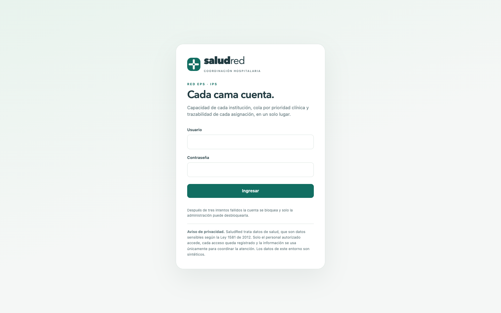 | 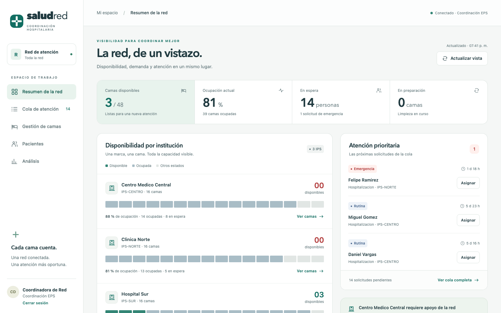 |
| **Inicio de sesión**, con el aviso de privacidad de la Ley 1581 de 2012 | **Resumen de la red**: camas por IPS (una marca, una cama) y las próximas solicitudes |
| 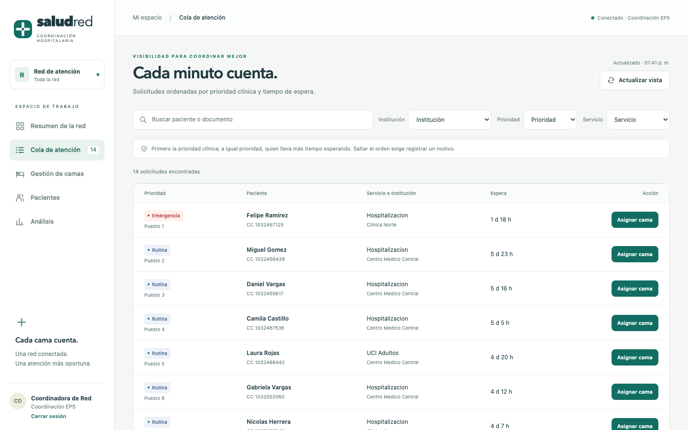 | 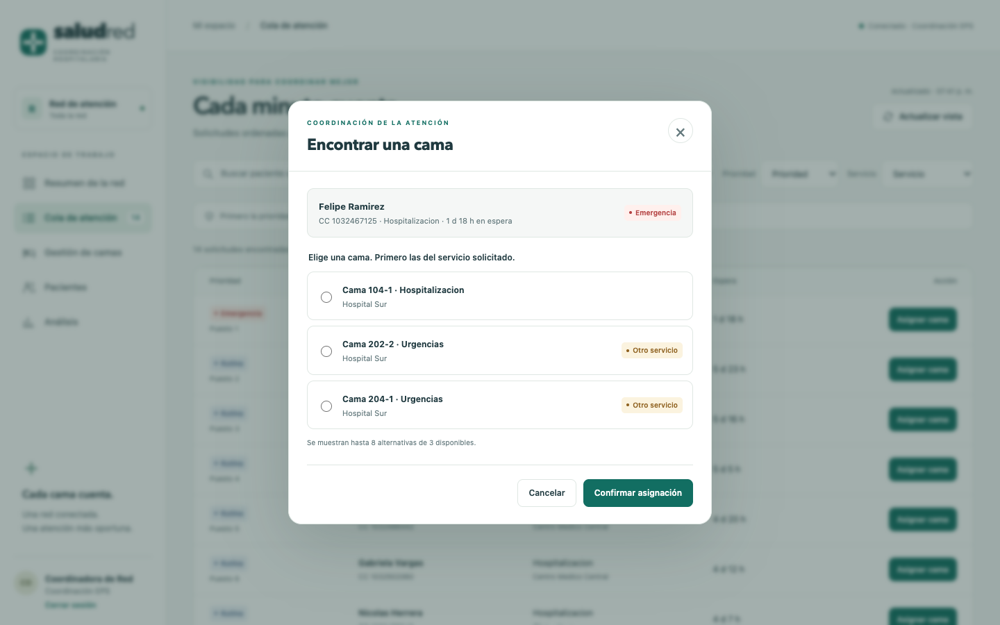 |
| **Cola de atención**, ordenada por prioridad clínica y tiempo de espera | **Asignar una cama**: primero las del servicio pedido |
| 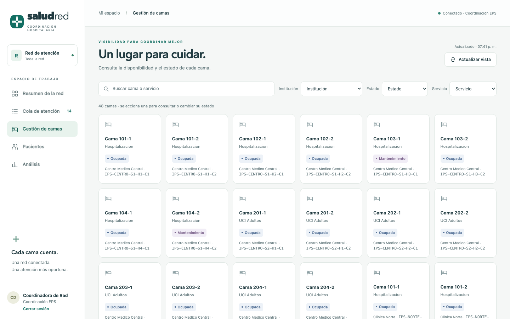 | 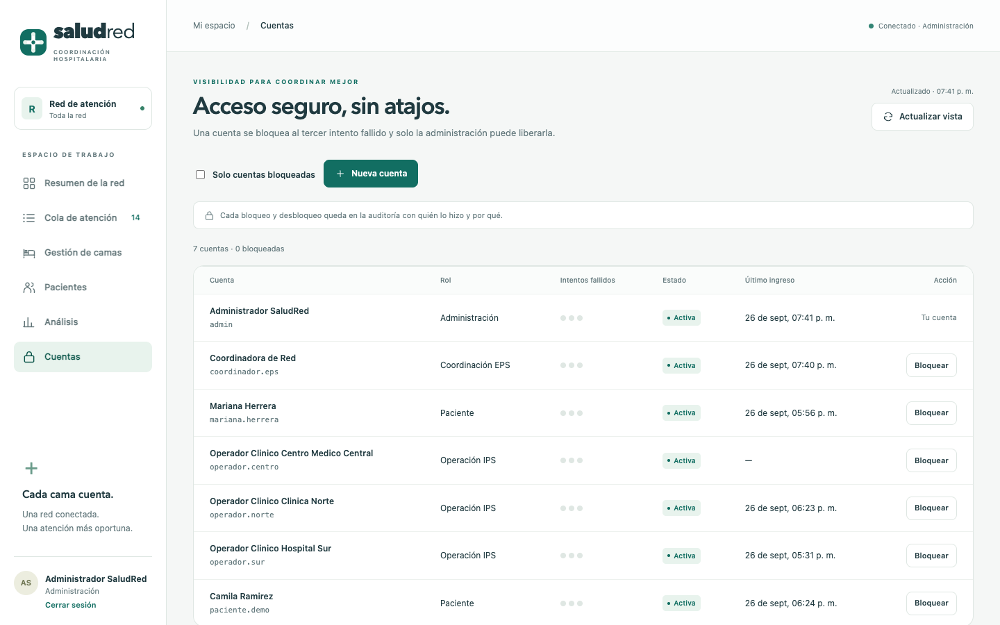 |
| **Gestión de camas**, con el estado de cada una | **Cuentas**: bloqueo por intentos fallidos, alta de cuentas y auditoría |
| 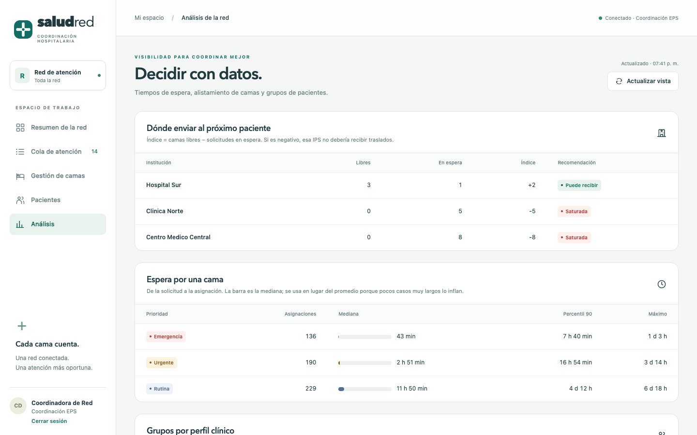 | 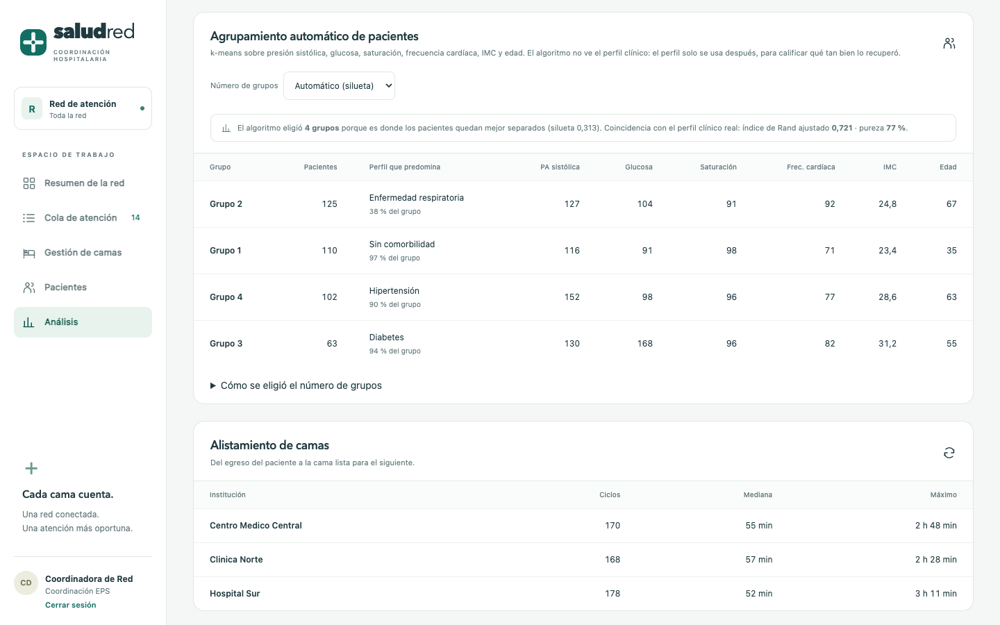 |
| **Análisis**: a qué IPS enviar al próximo paciente y espera por prioridad | **Agrupamiento k-means** calificado contra el perfil clínico |
| 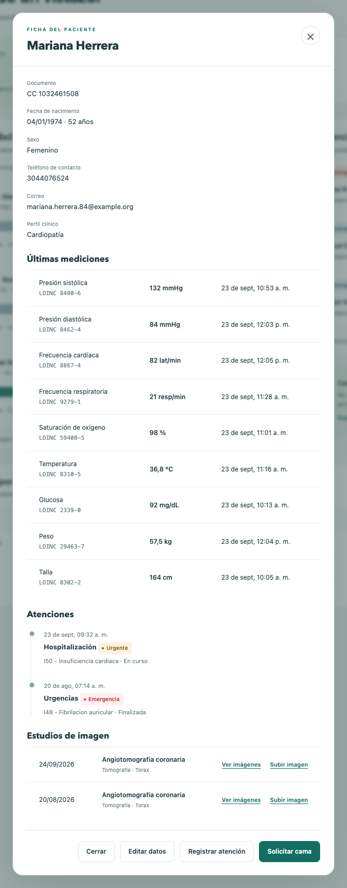 | 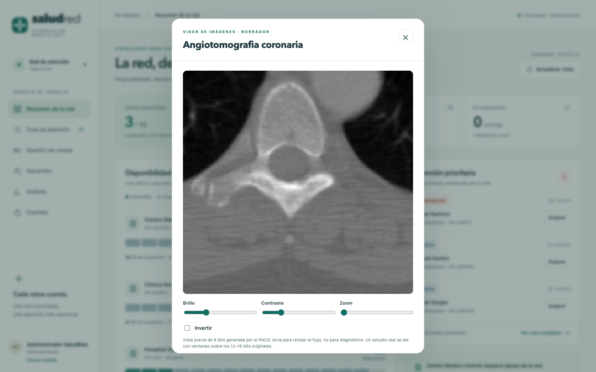 |
| **Ficha del paciente**: mediciones LOINC, atenciones y estudios de imagen | **Visor de imágenes** del PACS, con brillo, contraste y zoom |
| 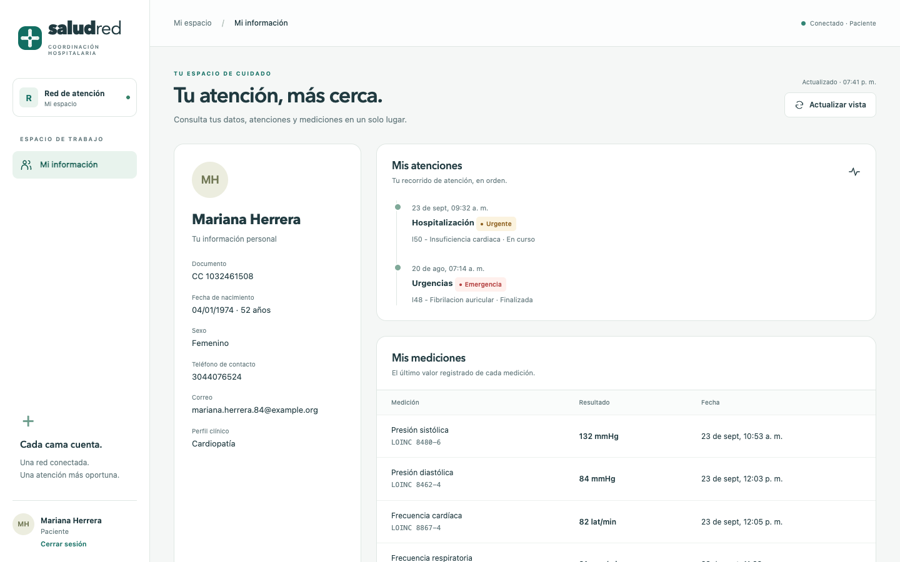 | |
| **Portal del paciente**: solo su propia información | |

## Puesta en marcha

Único requisito: **Docker y Docker Compose**. No hace falta instalar Python ni
dependencias en la máquina: todo vive dentro de los contenedores.

```bash
# 1. Configuración
cp .env.example .env
# Editar .env y poner un JWT_SECRET_KEY propio. Para generarlo:
#   docker run --rm python:3.12-slim python -c "import secrets; print(secrets.token_urlsafe(48))"

# 2. Levantar todo
docker compose up -d --build
```

Eso construye la imagen de la API y arranca cuatro servicios. Al iniciar, la API
espera a que PostgreSQL acepte conexiones, aplica las migraciones y carga los
datos sintéticos. Si la base ya tiene datos, el seed se omite solo.

| Servicio | URL |
|---|---|
| **Interfaz web** | http://localhost:8081 |
| API | http://localhost:8000 |
| Swagger | http://localhost:8000/docs |
| HAPI FHIR | http://localhost:8080/fhir |
| PostgreSQL | `localhost:5433` |

El servidor FHIR tarda entre 30 y 60 segundos en el primer arranque, mientras
construye su esquema. Está listo cuando responde:

```bash
curl http://localhost:8080/fhir/metadata
```

Comandos útiles:

```bash
docker compose logs -f api        # seguir el arranque
docker compose down               # detener
docker compose down -v            # detener y borrar los datos
```

### La interfaz web

El servicio `web` es un contenedor nginx con dos funciones: sirve los archivos
del front (`frontend/`) y hace de **proxy inverso** hacia la API. Las peticiones
a `/api`, `/health` y la documentación se reenvían al contenedor `api`.

Por eso el navegador solo habla con un origen: la interfaz y la API lo
comparten, y no hace falta configurar CORS en el backend. Al publicar, la URL
del túnel `tunnel-web` da acceso a la aplicación completa.

### Usar una base de datos gestionada (Neon)

Por defecto la aplicación usa el PostgreSQL del contenedor. Para apuntar a una
base gestionada, descomentar `DATABASE_URL` en `.env` con la cadena de Neon,
cambiando el prefijo `postgresql://` por `postgresql+psycopg://` y conservando
`?sslmode=require`. El contenedor `db` queda entonces sin uso.

### Publicar en internet

```bash
docker compose --profile public up -d
```

Eso levanta tres túneles de Cloudflare —la interfaz web, la API y el servidor
FHIR— que devuelven URLs públicas `https://...trycloudflare.com`. No se abre
ningún puerto en el router: el túnel establece una conexión saliente.

Para leer las URLs generadas:

```bash
# Linux y macOS
bash deploy/urls-publicas.sh

# Windows (Bypass afecta solo a esta invocación, no cambia la configuración)
powershell -ExecutionPolicy Bypass -File .\deploy\urls-publicas.ps1
```

El servidor FHIR sirve bajo la ruta `/fhir`, así que su CapabilityStatement
queda en `<URL de FHIR>/fhir/metadata`.

### PACS de imágenes (opcional)

```bash
docker compose --profile pacs up -d orthanc
```

Orthanc queda solo dentro de la red de Docker, con autenticación propia y el
puerto 8042 publicado únicamente en `127.0.0.1`. Su estado se consulta en
`GET /health/pacs`; si está apagado, la historia clínica sigue funcionando.

| Ruta | Qué hace |
|---|---|
| `POST /api/v1/imaging-studies/{id}/images` | Sube el archivo como cuerpo de la petición (DICOM, PNG o JPEG) al estudio ya registrado |
| `GET /api/v1/imaging-studies/{id}/images` | Lista las imágenes del estudio en el PACS |
| `GET /api/v1/imaging/instances/{id}/preview` | Vista previa PNG, con la misma regla de acceso que la ficha |

Cada imagen se guarda con el documento del paciente como `PatientID` y con el
`StudyInstanceUID` del estudio de nuestra base, que es lo que une los dos
sistemas.

> Las URLs de este tipo de túnel **cambian cada vez que el contenedor se
> reinicia**. Se generan cuando se van a usar y se comparten en ese momento.

## Autenticación y uso

Todos los endpoints de `/api/v1` (salvo el login) exigen un token Bearer:

```bash
curl -X POST http://localhost:8000/api/v1/auth/login \
  -H "Content-Type: application/json" \
  -d '{"username": "admin", "password": "<SEED_DEFAULT_PASSWORD>"}'
```

En Swagger, el botón **Authorize** acepta el `access_token` devuelto. Cuentas
creadas por el seed: `admin`, `coordinador.eps`, `operador.norte`,
`operador.sur`, `operador.centro` y `paciente.demo`, todas con la contraseña
definida en `SEED_DEFAULT_PASSWORD`. Son cuentas sintéticas de desarrollo y no
deben reutilizarse en un despliegue real.

Operaciones de trazabilidad expuestas por entidad: `PUT` conserva la versión
anterior (consultable en `GET /{id}/history`), `DELETE` es lógico, y
`POST /{id}/restore` (solo Admin) revierte la eliminación. La bitácora completa
se consulta en `GET /api/v1/audit-logs` (solo Admin).

La sincronización hacia FHIR se opera en `/api/v1/integration/fhir/*`: `POST`
empuja el registro (y sus dependencias) mediante actualización condicional por
identificador — reejecutarla no duplica recursos — y `GET` lee el recurso
directamente desde el servidor FHIR.

### Verificación

Los tres comandos se ejecutan dentro del contenedor de la API, donde ya están
todas las dependencias instaladas:

```bash
docker compose exec api pytest                       # pruebas (SQLite en memoria, sin tocar la base real)
docker compose exec api python -m scripts.demo_join  # consulta JOIN de validación del modelo
docker compose exec api python -m scripts.smoke_api  # prueba end-to-end de la API

# Incluye además la integración FHIR (requiere HAPI ya disponible):
docker compose exec -e SMOKE_FHIR=1 api python -m scripts.smoke_api
```

## Datos

Todos los datos son **sintéticos**. El sistema no procesa información clínica
real de ninguna persona.

```bash
docker compose exec api python -m scripts.seed --reset                 # 16 pacientes para la demo
docker compose exec api python -m scripts.seed --reset --patients 400  # volumen para análisis
```

`--reset` borra todo el contenido de la base antes de cargar.

El generador no reparte valores al azar dentro de un rango. Cada paciente tiene
un **perfil clínico** (sin comorbilidad, hipertensión, diabetes, cardiopatía,
enfermedad respiratoria o adulto mayor frágil) que determina sus signos vitales,
su prioridad al llegar, su estadía y los estudios de imagen que se le piden. Las
relaciones se respetan por construcción: la presión diastólica se deriva de la
sistólica y el peso sale de la talla y el IMC. Los perfiles se solapan en los
bordes a propósito, para que agrupar sea un problema real.

Las camas no se llenan al azar: se simula la red en el tiempo. Cada solicitud
espera en una cola de prioridad por IPS; cuando una cama termina su limpieza, se
la lleva la solicitud más urgente, que es la misma regla que aplica la API. La
red se dimensiona para operar cerca del 85 % de ocupación, de modo que la
escasez y la cola que resultan son consecuencia de la simulación.

Cada paciente usa su propia semilla: agrandar el conjunto no cambia a los
pacientes que ya existían, y dos ejecuciones producen exactamente los mismos
datos.

## Seguridad

- Las credenciales se leen de variables de entorno; `.env` está excluido del
  control de versiones y `.env.example` documenta la forma de la configuración
  sin contener ningún valor real.
- Las contraseñas se almacenan con bcrypt, nunca en texto plano.
- La autorización se resuelve en el backend por rol, por institución y por
  pertenencia del registro. Un endpoint no se protege ocultándolo.
- Tres intentos fallidos bloquean la cuenta. Una cuenta bloqueada se rechaza
  **antes** de verificar la contraseña, para no confirmar si era la correcta; un
  usuario inexistente recibe la misma respuesta que una contraseña incorrecta.
  Cada intento, bloqueo y desbloqueo queda en la auditoría.

## Estado

Prototipo académico funcional. La carga y visualización de imágenes en el PACS
existe como borrador: sube DICOM, PNG o JPEG a Orthanc a través de la API y
muestra una vista previa de 8 bits. Queda pendiente definir su alcance final.
No implementa OAuth2/SMART on FHIR, analítica predictiva ni optimización
automática de la asignación; esas quedan como extensiones posteriores.

## Licencia

Uso académico.
