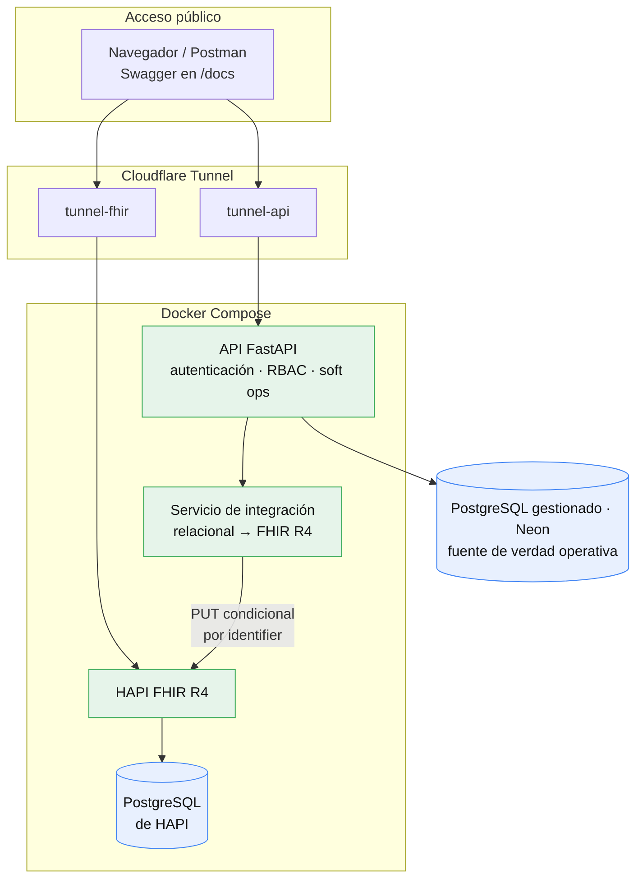
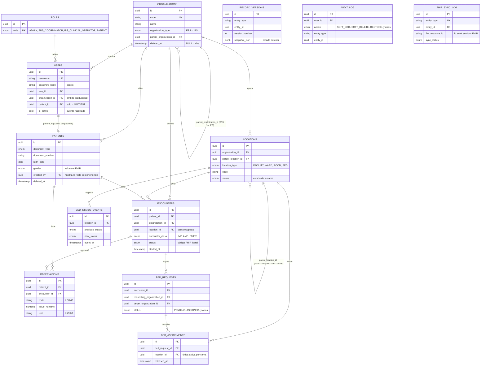
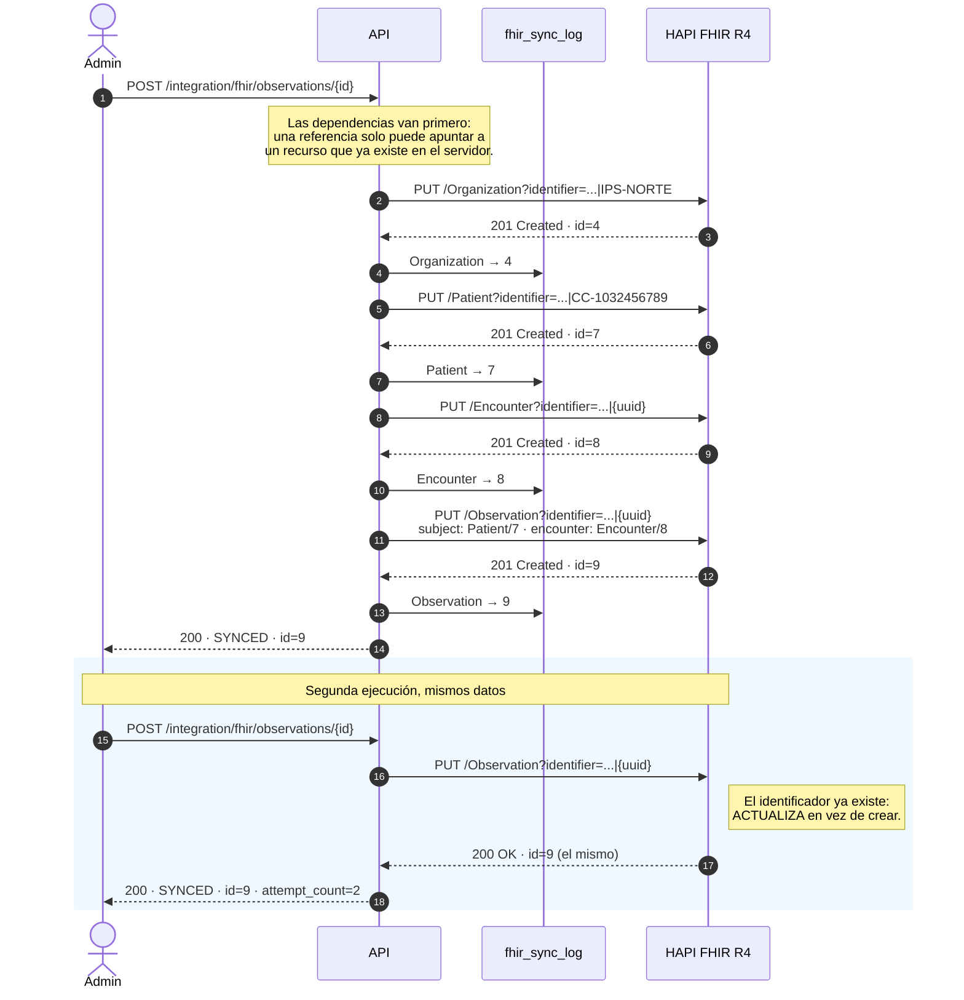
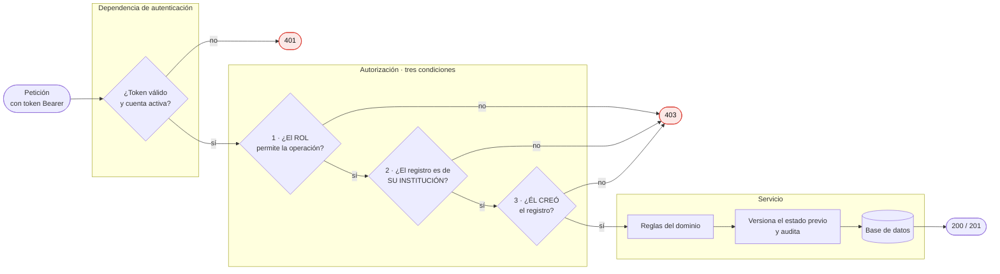

# Diagramas

Los diagramas están escritos en Mermaid, que GitHub renderiza directamente: no
hace falta ninguna herramienta ni mantener imágenes sincronizadas con el código.

---

## 1. Arquitectura

El servidor FHIR conserva su propia base de datos, separada de la de la
aplicación. Son dos sistemas con ciclos de vida distintos: la aplicación es dueña
del modelo operativo; HAPI es dueño de la representación interoperable y de su
esquema interno, que no controlamos. Compartir una sola base acoplaría nuestras
migraciones a decisiones de un producto de terceros.

---

## 2. Modelo entidad-relación

`RECORD_VERSIONS`, `AUDIT_LOG` y `FHIR_SYNC_LOG` no tienen llaves foráneas hacia
las entidades que describen: son tablas genéricas que sirven a cualquier entidad
mediante el par `(entity_type, entity_id)`. Por eso aparecen sueltas en el
diagrama. Agregar una entidad auditable nuevo no cuesta ninguna tabla adicional.

Dos jerarquías son autorreferenciadas —`ORGANIZATIONS` y `LOCATIONS`—, y eso es
lo que permite que **agregar una IPS o una cama sea una inserción de datos y no
una migración de esquema**.

---

## 3. Sincronización idempotente hacia FHIR

Este es el mecanismo que hace que ejecutar la sincronización dos veces no
duplique recursos.

La clave está en el verbo: en lugar de `POST`, se usa una **actualización
condicional** `PUT [servidor]/{Recurso}?identifier={sistema}|{valor}`, que FHIR
resuelve como *"crea si no existe, actualiza si ya existe"*. El identificador es
el dato de negocio —el documento de identidad del paciente, por ejemplo—, porque
es el valor con el que el servidor puede reconocer que se trata de la misma
entidad.

Como segunda garantía, `fhir_sync_log` tiene una restricción única sobre
`(entity_type, entity_id)`: una fila local solo puede corresponder a un recurso
FHIR.

Beneficio adicional: el enunciado cuenta `PUT` como un extra opcional. Esta
solución lo implementa por diseño.

---

## 4. Flujo de una petición y control de acceso

El usuario se relee de la base de datos en cada petición: **el token prueba
identidad, nunca permisos**. Así, deshabilitar una cuenta surte efecto de
inmediato en lugar de esperar a que el token expire.

En los listados, la condición institucional no se aplica descartando resultados
después de consultarlos: **se inyecta dentro de la consulta SQL**. Los registros
de otra institución no se ocultan, simplemente nunca se consultan.
